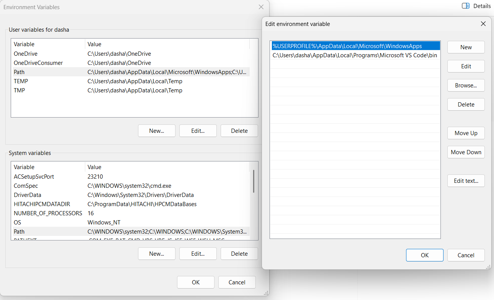
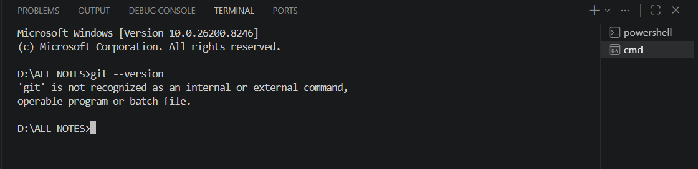
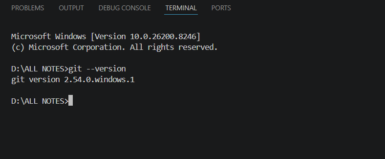

# Environment Variables — Complete Guide

---

## 1. What is an Environment Variable?

An environment variable is a **saved setting stored in Windows** that programs use to find important information — like where software is installed, who the current user is, or where to store temporary files.

**Real life analogy:**
Instead of memorizing your friend's full address every time you visit, you save it in your contacts as "John's House". Environment variables work the same way — instead of every program memorizing the full path `C:\Users\dasha\AppData\Local\Temp`, Windows just saves it as `TEMP` and every program reads it from there.

---

## 2. User Variables vs System Variables

When you open Environment Variables in Windows, you see two sections:

### User Variables
- Apply **only to your account**
- If another person logs into the same computer, they won't have these
- You do **not need admin** to edit these
- Example: your personal OneDrive location, your personal PATH

### System Variables
- Apply to **all users** on the computer and to Windows itself
- Changing these wrongly can **break Windows**
- You need **admin access** to edit these
- Example: where `cmd.exe` is, how many CPU cores exist

> **Rule of thumb:** Always edit User Variables. Only touch System Variables if you know exactly what you are doing.

---

## 3. What Each Variable Means

### User Variables

| Variable | What it does |
|---|---|
| `OneDrive` | Tells Windows where your OneDrive folder is |
| `OneDriveConsumer` | Same as above but for personal OneDrive account |
| `Path` | List of folders where Windows searches for programs |
| `TEMP` | Folder where programs store temporary files |
| `TMP` | Same as TEMP — older programs look for this name |

### System Variables

| Variable | What it does |
|---|---|
| `ComSpec` | Location of `cmd.exe` — never change this |
| `DriverData` | Folder where hardware drivers store their data |
| `NUMBER_OF_PROCESSORS` | How many CPU cores your computer has |
| `OS` | What operating system is running (Windows_NT) |
| `Path` | System-wide program search list (works for all users) |
| `PATHEXT` | Which file types Windows treats as programs (.EXE, .BAT, .CMD etc.) |

---

## 4. What is PATH — The Most Important Variable

PATH is a list of folder locations separated by semicolons.

When you type any command in the terminal like `python`, `git`, `gcc` — Windows does not magically know where that program is. It goes through every folder listed in PATH one by one and looks for that program.

**Example PATH value:**
```
C:\Windows\system32
C:\Program Files\Git\cmd
C:\Users\dasha\AppData\Local\Programs\Python\Python312
```

When you type `python`, Windows checks:
1. Is `python.exe` in `C:\Windows\system32`? — No
2. Is `python.exe` in `C:\Program Files\Git\cmd`? — No
3. Is `python.exe` in `C:\Users\dasha\...\Python312`? — **Yes! Found it. Run it.**

If none of the folders contain it, you get this error:
```
'python' is not recognized as an internal or external command
```

---

---
**Before adding new variable**

---
---
**After adding new variable**

---

## 5. The Full Flow — What Happens When You Run a File

Say you have a file `hello.py` in a folder called `programs` and you type this in the terminal:

```
python hello.py
```

Here is exactly what happens step by step:

**Step 1** — Windows reads the command. It sees two things:
- `python` — a program it needs to find
- `hello.py` — the file to give to that program

**Step 2** — Windows searches PATH folder by folder looking for `python.exe`

**Step 3** — Windows finds `python.exe` at `C:\Users\dasha\...\Python312\python.exe`

**Step 4** — Windows launches `python.exe` and passes your `hello.py` to it

**Step 5** — `python.exe` opens `hello.py`, reads your code line by line, executes it

**Step 6** — You see the output in the terminal

> **Key point:** You add the folder where `python.exe` lives into PATH. NOT your own `hello.py` file. Your file can be anywhere. Windows only needs to find the executor.

---

## 6. Real Life Analogy for the Full Flow

Imagine you say to your assistant: **"Call the plumber and tell him to fix my kitchen sink"**

| Real life | Terminal equivalent |
|---|---|
| Your assistant | Windows |
| "Call the plumber" | `python` |
| Your contacts list | PATH |
| Plumber's phone number | `C:\...\Python312\` |
| The plumber himself | `python.exe` |
| "Fix my kitchen sink" | `hello.py` |

If the plumber is not saved in your contacts — your assistant cannot call him.
If Python's folder is not in PATH — Windows cannot find `python.exe`.

---

## 7. What to Add to PATH for Each Language

Remember — you always add the **folder that contains the `.exe` file**, not your own code file.

| Language | What to install | Folder to add to PATH |
|---|---|---|
| Python | Python from python.org | `C:\Users\dasha\AppData\Local\Programs\Python\Python312\` |
| C / C++ | MinGW (GCC compiler) | `C:\MinGW\bin` |
| Java | JDK from oracle.com | `C:\Program Files\Java\jdk-21\bin` |
| JavaScript | Node.js from nodejs.org | Added automatically during install |
| Git | Git from git-scm.com | `C:\Program Files\Git\cmd` |

---

## 8. How to Add a Folder to PATH — Step by Step

1. Press `Windows + S`, search **"Environment Variables"**, open it
2. In the **top section** (User variables), click on the row that says **Path**
3. Click **Edit...**
4. Click **New**
5. Type the folder path (example: `C:\Program Files\Git\cmd`)
6. Click **OK → OK → OK**
7. **Restart VS Code** completely (close and reopen)
8. Open terminal in VS Code (`Ctrl + backtick`) and test:

```bash
git --version
python --version
gcc --version
node --version
```

If you see a version number — it worked!

---

## 9. Why Git Worked Only With Admin

When you opened VS Code normally, it used your **User PATH** — which did not have Git's folder in it.

When you opened VS Code as admin, it used the **System PATH** — which already had Git because Git installer added it there.

**Fix:** Add `C:\Program Files\Git\cmd` to your **User PATH**. Now Git works without admin in VS Code.

---

## 10. Quick Summary

| Question | Answer |
|---|---|
| What are environment variables? | Saved settings that Windows and programs read |
| What is PATH? | A list of folders where Windows searches for programs |
| What do I add to PATH? | The folder where the program's `.exe` file lives |
| What don't I add to PATH? | My own code files like `hello.py` |
| User vs System variables? | User = your account only, System = everyone |
| Why edit User PATH not System? | No admin needed, safer, achieves the same result |

---

## 11. Finding Files and Folders Using Commands

When you install Python, Git, GCC etc. and you are not sure where they got installed, use these commands to find them. Open terminal in VS Code or open CMD.

---

### Find where a program is installed

If the program is already in PATH, this tells you the exact location:

```bash
where python
where git
where gcc
where node
```
> **Note:** This command is works on admin mode, if you add new path in environment variable for all this program it will work

Example output:
```
C:\Users\dasha\AppData\Local\Programs\Python\Python312\python.exe
```

That folder `C:\Users\dasha\AppData\Local\Programs\Python\Python312\` is exactly what you add to PATH.

---

### Find a file by name anywhere on your computer

```bash
# Search for a file by name inside a specific folder and all its subfolders
dir /s /b C:\python.exe

# Search in the whole C drive (slower but finds everything)
dir /s /b C:\ python.exe
```

`/s` means search inside all subfolders too
`/b` means show only the full path, no extra details

---

### Navigate folders in terminal

```bash
# See which folder you are currently in
cd

# Go into a folder
cd programs

# Go into a folder using full path
cd C:\Users\dasha\programs

# Go back one folder
cd ..

# Go back two folders
cd ..\..

# See all files and folders in current location
dir

# See all files including hidden ones
dir /a
```

---

### Check if a program is working

```bash
python --version
git --version
gcc --version
node --version
java --version
```

If you see a version number — it is installed and in PATH correctly.
If you see "not recognized" — it is not in PATH yet.

---

### Print current PATH value in terminal

```bash
echo %PATH%
```

This shows you all folders currently in your PATH, separated by semicolons. Useful to check if a folder is already added or not.

---

### Find where python.exe or any exe is if "where" does not work

Sometimes a program is installed but not in PATH yet, so `where` won't find it. Use this to search:

```bash
# Search entire C drive for python.exe
dir /s /b C:\python.exe 2>nul

# Search entire C drive for git.exe
dir /s /b C:\git.exe 2>nul
```

`2>nul` hides the "access denied" error messages so output stays clean.

---

## 12. User Mode vs Admin Mode — How to Switch

### What is the difference?

| | User Mode | Admin Mode |
|---|---|---|
| What it is | Normal way of opening programs | Elevated access — can modify system files |
| Can edit User PATH? | Yes | Yes |
| Can edit System PATH? | No | Yes |
| Can install software system-wide? | No | Yes |
| Risk of breaking Windows? | Low | Higher |

---

### How to open CMD or VS Code as Admin

**Method 1 — Right click**
- Find CMD or VS Code in Start Menu or Desktop
- Right click on it
- Click **"Run as administrator"**
- Click Yes on the UAC popup

**Method 2 — Search bar**
- Press `Windows + S`
- Type `cmd`
- You will see **"Run as administrator"** on the right side
- Click it

**Method 3 — From inside CMD (switch to admin)**
- Open normal CMD first
- Type this command:
```bash
runas /user:Administrator cmd
```
- It will ask for the Administrator password
- A new CMD window opens with admin rights


---

### How to check if you are currently in admin mode

In CMD type:
```bash
whoami /groups | find "S-1-16-12288"
```

If it returns a result — you are in admin mode.
If it returns nothing — you are in normal user mode.

Simpler way — just look at the CMD title bar. If it says **"Administrator: Command Prompt"** at the top, you are in admin mode.

---

### Open VS Code as admin from terminal

```bash
# Open VS Code as admin from CMD (when already in admin CMD)
code .

# Or directly from run dialog (Windows + R)
# Type this and press Ctrl + Shift + Enter instead of just Enter
# That runs it as admin
code
```

---

### Temporarily run a single command as admin without opening a new window

```bash
runas /user:Administrator "command here"
```

Example — run a Python script as admin:
```bash
runas /user:Administrator "python C:\Users\dasha\programs\hello.py"
```

---

### Why you should NOT always use admin mode

Running everything as admin is dangerous because:
- Any program you run also gets admin rights
- A bad script or virus can delete or modify system files
- You can accidentally break Windows PATH or system settings

The correct habit is — run normally by default. Only switch to admin when something specifically requires it like installing software system-wide or editing System variables.

---

## 13. Full Quick Reference — All Commands in One Place

```bash
# ── FINDING PROGRAMS ──────────────────────────────
where python                        # find where python.exe is
where git                           # find where git.exe is
dir /s /b C:\python.exe 2>nul       # search whole C drive for python.exe

# ── CHECKING VERSIONS ─────────────────────────────
python --version
git --version
gcc --version
node --version
java --version

# ── NAVIGATING FOLDERS ────────────────────────────
cd                                  # show current folder
cd foldername                       # go into a folder
cd C:\Users\dasha\programs          # go to full path
cd ..                               # go back one folder
dir                                 # list files in current folder
dir /a                              # list all files including hidden

# ── PATH RELATED ──────────────────────────────────
echo %PATH%                         # print current PATH value

# ── ADMIN MODE ────────────────────────────────────
runas /user:Administrator cmd       # open new CMD as admin
whoami /groups | find "S-1-16-12288"  # check if currently admin
```

---

*Whenever you install a new language or tool and it doesn't work in the terminal — the answer is almost always: find where it installed its `.exe` file and add that folder to your User PATH.*
